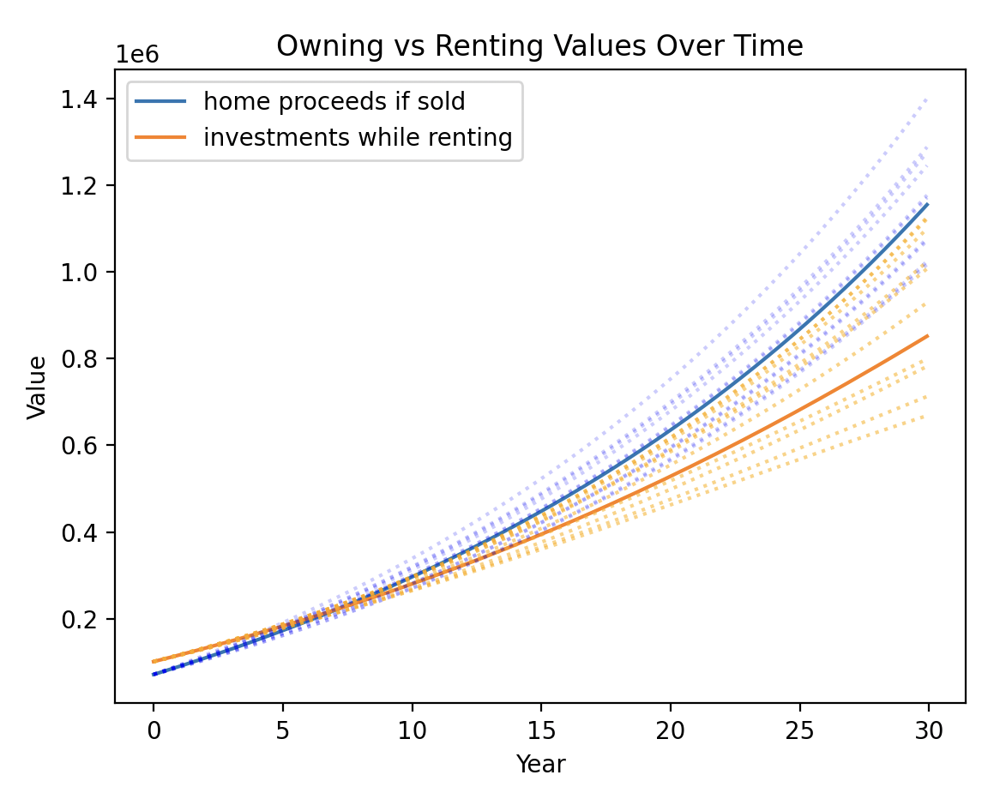
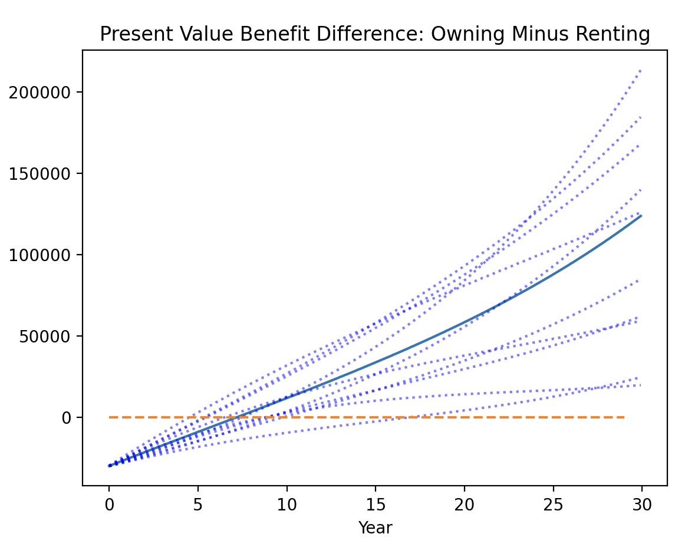

# How to Run

Make sure you have the latest version of Python installed. You should also have `numpy` and `matplotlib` installed. 

Edit your parameters directly in the Python file. Then run:

```
python rent_vs_buy_model.py
```

# How to Interpret

## Example Output

```
Your down payment will be $100000.0
Your monthly mortgage payment, excluding insurance and taxes, will be $2554.64
You break even in 10 out of 11 simulations. When you break even it takes on average 7.28 years.
Breaking even could take as little as 3.92 years or as long as 14.67 years.
The average ending present value benefit of owning over renting is $109660.81
```




## Printed Statements
You get a few printed statements:
- How much your down payment will be, according to your down payment percentage and the purchase cost.
- How much your fixed monthly mortgage payment will be (only interest and principal, excluding insurance, property taxes, HOA, PMI, etc, which all vary over time)
- How many years it takes to break even, if ever. "Breaking even" means the value of ownership finally exceeds the value of renting. If you run additional simulations, you will get the average, minimum, and maximum breakeven times.
- How much the average present-value benefit is of owning over renting at the end of the mortgage term (see below).

## Graph 1: Owning Vs Renting Values Over Time
This graph compares the dollar values of owning vs renting over each month period of the mortage term. So for any given month, I compare the net proceeds you get from selling the house *in that month* to the investment value of your down payment had you not bought the house and continued renting instead. Some important things to note:

- The rental side of the equation is not just your down payment increasing in value. You also get any of the additional costs of homeownership (insurance, taxes, etc) minus your monthly rent added to your growing investments. This is fair because that's money you would not have spent renting that you now get to keep for investing/saving.
- Also for fairness, if your rent exceeds the additional fixed costs of homeownership, then that difference is *deducted* from the investment value of the rental scenario. 
- The homeownership side of the equation is the value of your home equity minus the transaction cost. That's why at the very beginning of the model, renting always beats owning. If you buy a home and immediately sell it, you're out the transaction cost, but if you just invested and rented, you would still have the full value of your down payment.

## Graph 2: Present Value Benefit - Owning Minus Renting
As the two curves of the Graph 1 diverge, you might be tempted to look only at the dollar difference between the two curves. However, keep in mind that both sides of those equations are growing with inflation, so a dollar difference in 2040 is in "2040 dollars". This second graph plots the difference between the two curves over time, all adjusted in "today's dollars." The breakeven point is when this line crosses zero, and that should match the breakeven statement and the intersection point in graph 1.

This helps answer a question like "If I sold the house in ten years, how much richer or poorer would I be in today's dollars compared to having rented for the next ten years?" The answer to that question is what I call the "price of renting/flexibility" if it's positive or the "price of homeownership" if it's negative.

## Additional Simulations
If your NUM_ADDITIONAL_SIMULATIONS parameter is non-zero, you get to play around with the variance of four assumed parameters. See the comments for more details on how that's calculated.

The benefit of this is you get dotted lines on your graphs that represent the outcomes of additional simulations had you chosen slightly different values for each of those four parameters. This allows you to see the "spread" over time, and get a sense of how variable your outcomes can be as a result of factors that are entirely outside of your control (those four parameters were selected on the basis of being unpredictable and uncontrollable). 

I encourage you to play around with this. At first it might be discouraging to see how variable the outcomes can be. However, once you've seen highly variable outcomes, go back to your known parameters and play around with those (like the cost of rent or your home purchase price), and you might see that even with high variance, some scenarios are still very clearly "you should buy" or "you should rent." This feature should give you an intuitive sense of how sensitive a particular situation is to macro-economic circumstances. If you clearly benefit from one scenario despite a high variance, you're pretty immune to economic circumstances (i.e. "recession-proof"). But if you keep generating models that are all over the place, then that means your individual circumstances are such that your financial outcome will depend heavily on how well the home and stock markets perform over the next decades. How comfortable you are with that variance is up to you.

# Not Modeled

These are factors I intentionally did not model, but could potentially have an impact on your decisions. It's worth reading through this just to know what's missing from this picture and why. I tried to order these according to what I'd assume to have the greatest impact on the predictions.

## Those fuzzy, prickly feelings
More than anything else, I can't model how any of this makes you feel. Maybe homeownership is less financially interesting but the pride you get from owning a home outweighs the cost. Maybe renting is less financially interesting but feeling flexible and not having to deal with plumbers is worth that price. The point is the model gives you a dollar amount that tells you how much the more costly option costs, and then you can decide if that "feels right." 

Feelings worth considering on the homeownership side: Pride, Peace of Mind of a Long-term Fixed Cost that Disappears in Retirement, Possibility of Inter-generational wealth (your house is more likely to be financially interesting for your children than for you), Control and Decisions about Renovations

Feelings worth considering on the rental side: Flexibility, Peace of Mind of No Maintenance or Emotional Attachment, Freedom, Adaptability to Changing Economic Circumstances, Ability to Explore Opportunities more Frequently

## Prepayment/Refinancing
With a high interest rate, you might wonder what would happen if you prepay your mortgage early. You could also be tempted to model what would happen if interest rates drop and you refinance your mortgage in, say, five years. This could save you a lot in interest. It's important to remember that you only save the interest you *would have spent while living there*. As an example, if you live there 10 years, but prepay your entire thirty-year mortage within six (or refinance substantially), you only save the interest you would have paid in those last four years you live there, not the total interest of the remainder of the term (because whenever you sell, you are essentially prepaying the rest of the principal at that moment).

Another thing to consider is that prepayment/refinancing really only affects interest, which is tax-deductible. So while you might save \$100k in ten years, if your marginal tax rate is 25\%, you will actually only save \\\$75k. At the same time, if you prepay money willingly, that's money that would have been able to invest in the rental scenario, so however much you prepay is money that could have grown at the investment appreciation rate on the other side of the model, which could nullify the interest savings that improve the homeownership model. Given all these complications, I consider prepayment/refinancing to be a worthwhile consideration *only after* purchasing your home. It's probably not worth considering too deeply when deciding *whether* to purchase a given home.

## Adjustable Rate Mortgages (ARMs)
There are special mortgages that have adjustable interest rates, that fluctuate with the market. I've never investigated these deeply, but I remember I had a bad feeling about them a long time ago and mostly dismissed them. As a result, they're not modeled here. In any case, the unpredictability of the future and the nature of these mortgages makes them much harder to model--you'd have to predict what interest rates are going to do as part of your decision. Personally, I prefer a fixed-rate mortgage with the ability to refinance in the future if a favorable interest rate turn up. I'm never interested in risking being subjected to higher interest rates down the line.

## Location, Location, Location
Since I'm assuming you can compare a rental to a comparable purchase, I'm also assuming that anywhere you want to live has an available supply of both rentals and purchases. This might not be true everywhere. Maybe you want a particular school district, and there are very few available rentals. Maybe purchasing a home places you twenty miles farther from your job than the apartment you would have rented, which increases transportation costs. None of this is modeled, mostly because I consider the differences to be negligible or nonexistent.

If location is important in your home search, it might be more useful to compare a home purchase in the same zip code or neighborhood as a comparable rental. You can do that just by changing the rental amount as a parameter, according not to your current rent, but the average rent of that area. This makes sense, as it might not be fair to compare your rental in Austin to a purchase in Miami. On the other hand, that might be exactly what you're trying to do--maybe you know if you move to Miami you'd be buying a particular type of house in a particular type of neighborhood, but if you decide renting is better you'll stay in Austin. This is up to you and how you set the model's existing parameters, so I decided it's not worth trying to model these differences directly. 

## Renter's Insurance
I figured this might not be particularly useful, especially since it's a nice-to-have, not a must-have. Everything else in this model is a required expense, so it felt unfair to burden the "rental" side of the equation with a cost most people don't actually engage in. But if you consider this a necessity, maybe because you need to insure valuable possessions in your rental, it could be included fairly easily by estimating the insurance cost per month and just adding it to the existing RENT parameter.

## Renter's Adjustable Lease Lengths
This model assumes your rent stays constant for 12 months, and then jumps up according to your assumed RENTAL_ANNUAL_INFLATION rate, then stays constant again for another 12 months. That's in accordance with most 12-month renewable leases. I understand that some folks can sign even longer leases in the hopes of maintaining the same (lower) rate for longer periods at a time. Over time those savings could theoretically have a significant impact, but probably not enough to be worth modeling. In any case, you rent for the flexibility, so you can't be sure that you'll be able to sign 18- or 24-month leases in three years when you potentially move to some new place.

## Escrow Accounts
This model assumes that you pay your mortgage, insurance, and property taxes monthly. That's true for most people that open "escrow" accounts when they take out a mortgage. In reality, insurance and property taxes are paid annually, and you can elect to pay those yourself (which is what I do), which allows you to hold on to that money (and the interest yielded from those savings) until it's actually due. Most people elect to just pay their mortgage company and let them handle the deadlines, though. In either case, based on some back-of-the-envelope calculations, I don't think the difference of "whether you have an escrow account" is worth modeling.

The same is true, but more substantially, of maintenance expenses. This model assumes you pay a certain amount monthly to maintain your house. In reality, you might pay nothing for five years and then replace the roof for \$20k. That's a meaningfully different financial outcome. However, because "maintenance" is a category that implies "unforeseen expenses", it's hard to predict and highly variable. I think modeling it as a monthly expense/savings is accurate enough for our purposes. Even if you pay nothing for five years and then replace the roof, it's possible the expense is so unexpected you have to take out a loan and pay interest on that loan, which could end up nullifying the benefit of having invested the extra money for five years and seen it grow. Treating this as a monthly expense is a way of simplifying all that.

## Utilities
Might be included in the future (specifically, the difference in utility cost once you move to purchasing).

# A Note On Marginal income tax rates
The marginal income tax rate is used to estimate how much you save on taxes by spending money on mortgage interest, since that expense is uniquely deductible. This can have a substantial (beneficial) impact on the cost of homeownership, particularly in the early years. 

### Why isn't this variable? I might make a lot more money in twenty years.
That's true, but mortgage interest is front-loaded and is largely paid in the first half of the mortgage term. For most mortgages, that means this has the most impact in the next 3-10 years. So I didn't feel that varying the income tax rate was worth modeling--just use whatever you expect to be your marginal tax rate in the next few years. If you're close to the "edge" of a tax bracket, you can consider averaging the two.